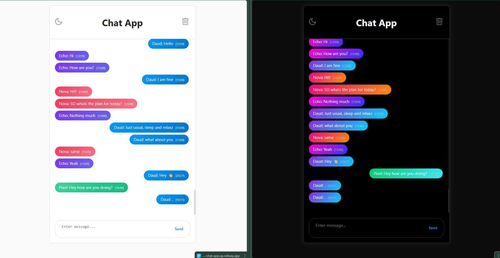

# Chat App

A simple real-time chat application built with **HTML**, **CSS**, **JS**, **Node.js**, **Express**, **Socket.io**, and **MongoDB**. This app allows multiple authorized users to send and receive messages instantly, with features like login authentication, message timestamps, and colored message bubbles per user.

---

## Table of Contents

- [Features](#features)  
- [Concept & Working](#concept--working)  
- [Technologies Used](#technologies-used)  
- [Setup & Running](#setup--running)  
- [Folder Structure](#folder-structure)  
- [Picture](#picture)

---

## Features

1. **Login Authentication**  
   - Only authorized users can access the chat.  
   - Uses a hardcoded username-password combination for now.  

2. **Real-Time Messaging**  
   - Users can send messages instantly.  
   - Other users connected to the app receive the messages immediately.  

3. **Message History**  
   - Loads the last 50 messages when a user joins.  
   - Messages are stored in **MongoDB**.  

4. **Colored Message Bubbles**  
   - Messages sent by each user is of different color to differentiate betweeen users.  

5. **Timestamps**  
   - Each message shows the time it was sent (hour and minute).  

6. **Responsive UI**  
   - Works on most of the devices.   

7. **Dark mode**
   - Dark mode option available with amoled dark theme and vibrant colored chat bubbles. 
---

## Concept & Working

1. **Server (server.js)**  
   - Runs an Express server and serves the frontend files.  
   - Uses Socket.io for real-time communication.  
   - Connects to MongoDB to store and retrieve messages.  
   - Handles login authentication via `/login` endpoint.  

2. **Client (main.js)**  
   - Handles login form submission and stores the logged-in username.  
   - Connects to the server via Socket.io.  
   - Sends messages along with the sender and timestamp.  
   - Receives messages from other users and appends them to the chat.  
   - Applies `sent` class for messages from the current user.  

3. **Message Persistence**  
   - Every message is saved in MongoDB with `sender`, `text`, and `timestamp`.  
   - When a new user joins, the server sends the last 50 messages to populate the chat history.  

---

## Technologies Used

- **Node.js** - Backend runtime  
- **Express** - Web server and routing  
- **Socket.io** - Real-time messaging  
- **MongoDB** - Database to store messages  
- **Mongoose** - ODM for MongoDB  
- **HTML/CSS/JS** - Frontend  
- **dotenv** - Manage environment variables  

---

## Setup & Running

### 1. Clone the repository

```bash
git clone <repo-url>
cd chat-app
```

### 2. Install dependencies

```bash
npm install
```

### 3. Add environment variables

Create a `.env` file in the root directory and add your MongoDB URI:

```env
MONGO_URI=<your-mongodb-connection-string>
```

### 4. Run the app

```bash
npm start
```

### 5. Open in browser

```
http://localhost:3000
```

---

## Folder Structure

```
chat-app/
├─ public/
│  ├─ css/
│  │  ├─ style.css
│  │  ├─ login.css
│  │  ├─ darkmode.css
│  │  └─ responsive.css
│  ├─ index.html
│  └─ main.js
│
├─ models/
│  └─ Message.js
│
├─ node_modules/
├─ package.json
├─ package-lock.json
├─ .env
└─ server.js

```

## Picture


